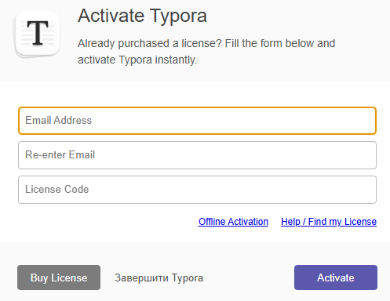
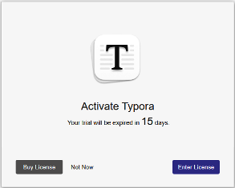
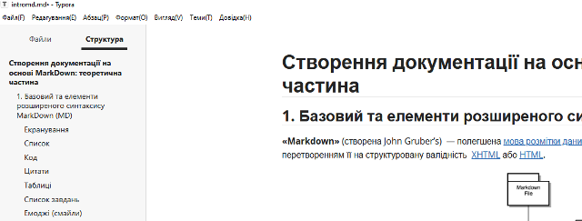
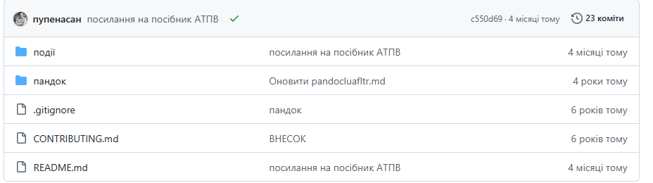
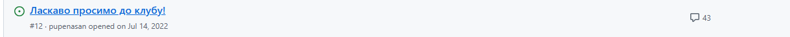
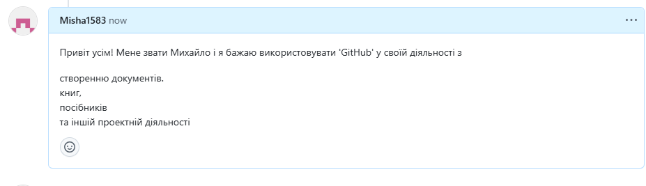
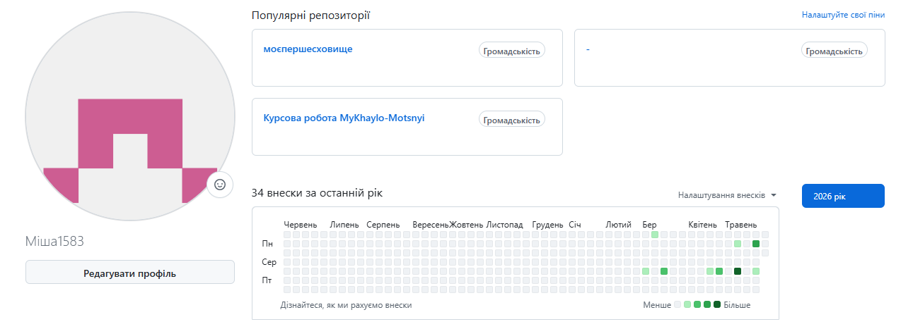

- Завантажте Typora з розділу завантаження офіційного сайте [typora.io](https://typora.io/)
-  Встановіть Typora на свій ПК
-  Запустіть Typora після завантаження.

Даний редактор є платним, але можна користуватися пробною версією з обмеженнями. Хоч вартість ліцензії невелика, і якщо Ви плануєте використовувати Markdown у Вашій професійній діяльності варто подумати над покупкою (власне автор даного практичного заняття купив ліцензію), у даному практичному занятті вважатиметься, що Ви користуєтеся пробною ліцензією.

-  Натисніть кнопку `Start 15 Days Trial` для активації 15-денної ліцензії
-  Перейдіть в пункт меню `File->Refernces->General->Language` і виберіть інтерфейс Українською мовою.
-  Перезапустіть typora щоб налаштування вступили в силу. Кожного разу коли запускатимете Typora, вибирайте `Not Now`.

Якщо все зроблено вірно, то в редакторі Ви повинні побачити структуру документу, рисунок, посилання і т.п.

- Ознайомтеся з контекстним меню, клікнувши праву кнопку миші.
-  Переключіться в режим джерельного коду і в зворотному напрямку, використовуючи меню `Вигляд -> Режим джерельного коду` або відповідну кнопку в правому нижньому кутку екрану  .

### 4. Робота з формулами в Typora

-  Зайдіть в меню `Файл->Параметри->Markdown` і активуйте опцію `Формули в рядку`.

Це дає можливість створювати вбудовувані в рядки формули.

-  Перезапустіть Typora
-  Реалізуйте пункт 2 (LaTeX/Mathematics) з раніше [завантаженого](https://drive.google.com/file/d/1tp6mh7XUjm-iZQd3aZW6g46pGxPBm39y/view?usp=sharing) документу.

### 5. Робота з Mermaid в Typora

За замовченням в Typora активована можливість роботи в Mermaid, однак варто перевірити.

-  Зайдіть в меню `Файл->Параметри->Markdown` і активуйте опцію Графіки в розділі `Підтримка синтаксису`, якщо ця опція не стоїть.
-  Реалізуйте пункт 3 Mermaid) з раніше [завантаженого](https://drive.google.com/file/d/1tp6mh7XUjm-iZQd3aZW6g46pGxPBm39y/view?usp=sharing) документу.
- 

# Створення документації на основі MarkDown: теоретична частина

## 1. Базовий та елементи розширеного синтаксису MarkDown (MD)

«Markdown» (створена John Gruber’s) — полегшена мова розмітки даних, яку створено з ухилом на прочитність та зручність у публікації з подальшим перетворенням її на структуровану валідність XHTML або HTML.

*рис.1. Принцип роботи застосунків Markdown.*

### Екранування

зірочка - \*

### Список

- Пункт в маркованому (ненумерованому) списку
  - Підпункт, відділений 4 пробілами
    - підпункт третього рівня, виділений 4 пробілами
- Інший пункт в маркованому списку

1. Пункт в нумерованому списку
2. Інший пункт в нумерованому списку

### Код

Hello world!

Цитати

Весь цей абзац тексту є цитатою і буде поміщений у HTML blockquote елемент.
Blockquote елементи змінюються в залежності від потреби або пристрою виводу.
Ви можете обернути довільний текст за власним смаком, і воно перетвориться
на єдиний blockquote елемент.

| Syntax    | Description |
| --------- | ----------- |
| Header    | Title       |
| Paragraph | Text        |

Список завдань

 Write the press release

 Update the website

 Contact the media

Емоджі (смайли)

Gone camping! ⛺ Be back soon.

That is so funny! 😂

## 2. LaTeX / Mathematics

Приклади математичних формул у Markdown (LaTeX):

$$
\cos(2\beta) = \cos^2\beta - \sin^2\beta
$$

$$
\lim_{y \to \infty} e^{-y} = 0
$$

$$
k_{n+1} = n^3 + k_n^2
$$

$$
n^{22}
$$

Функція:

$$
f(a) =
\begin{cases}
a/2, & \text{if a is even} \\
(a+1)/2, & \text{if a is odd}
\end{cases}
$$

3. Mermaid

graph TD
    PC --> soft1
    PC --> soft2
    PC --> soft3
    PLC --> PC

У знайденому буде різноманітні ресурси, серед яких репозиторії `GitHub`. Натисніть по `pupenasan/Git4All`

- Нижче йдуть закладки, які надають різні можливості роботи з репозиторієм. Наразі нас цікавить:
  - `Code` - де відображається перелік файлів в репозиторії а для деяких файлів можна переглянути і зміст. За замовченням внизу відображається зміст файлу `README.md`
  - `Issues`, `Discussions` - дає можливість обговорювати проєктну діяльність, тобто задавати питання, робити зауваження тощо

Скористаємося обговореннями для створення першого повідомлення. Перейдіть в закладку `Issues` і натисніть по темі `Ласкаво просимо до клубу`.

 Напишіть певний текст в коментарі, представтеся, напишіть коротко що очікуєте від знайомства з GitHub. Після редагування, перегляньте форматований результат, натиснувши `Preview` .

Тут я показую профіль в github

