#### Завантаження, встановлення та запуск MQTT Explorer

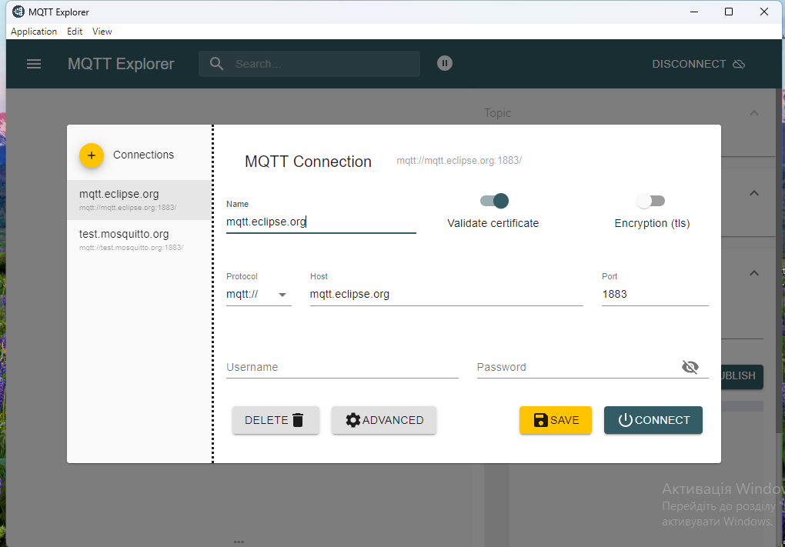

-  Завантажте та встановіть MQTT Explorer
-  Запустіть на виконання MQTT Explorer
-  Виберіть наперед-сконфігуроване з'єднання `mqtt.eclipse.org`, подивіться на налаштування і натисніть `Connect`.
-  Якщо з'єднання не працює, перевірте аналогічно наперед-сконфігуроване з'єднання `test.mosquitto.org`

Після з'єднання Ви побачите усі теми, які публікуються на брокері.

-  Введіть фільтр `$SYS` для відображення тільки системних повідомлень


рис.2. Фільтрування системних повідомлень на брокері

-  Зробіть огляд гілок та значень в `$SYS`
-  Знайдіть і виберіть тему `clients/connected`, який показує кількість підключених клієнтів. У деталізації `History` Ви побачите перелік усіх повідомлень, які були отримані з початку сеансу а також їх значення у вигляді графіку.


рис.3. Деталізація переліку повідомлень

-  Натисніть `Disconnect`. Зайдіть в налаштування `Advanced`. Подивіться налаштування: у списку тем вказано фільтр підписки на усі теми. На кожну тему підписка вказана з `QoS=0`
-  Перевірте підключення до `test.mosquitto.org`

####  Робота з HiveMQ Вебсокет-клієнтом

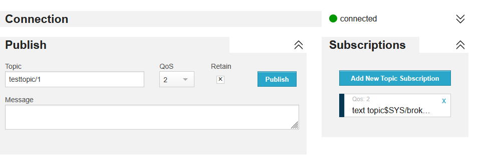

-  У браузері зайдіть на http://www.hivemq.com/demos/websocket-client
-  На сторінці Вебсокет-клієнта в полі Host введіть:
  - **mqtt.eclipse.org**
  - в полі Port **80** (over WebSocket),
-  Якщо **mqtt.eclipse.org**  не працює, на сторінці Вебсокет-клієнта в полі Host введіть:
  -  **test.mosquitto.org**
  -  в полі Port **8081** (over WebSocket),
  -  залиште виставленою опцію SSL
-  після чого натисніть кнопку Connect. Повинен з’явитися напис Connected.
-  Натисніть `Add New Topic Subscription` і в полі `Topic` задайте

```
$SYS/broker/clients/connected
```

​                          

-  Тепер у полі Messages виводимуться повідомлення з даної теми

У випадку відсутності зв’язку з брокером зробіть перевірку на `test.mosquitto.org`.

#### Публікація і підписка для власного повідомлення


-  На онлайновому клієнті HiveMQ створіть нову тему для публікації:

```
myname/device1/val
```

​                           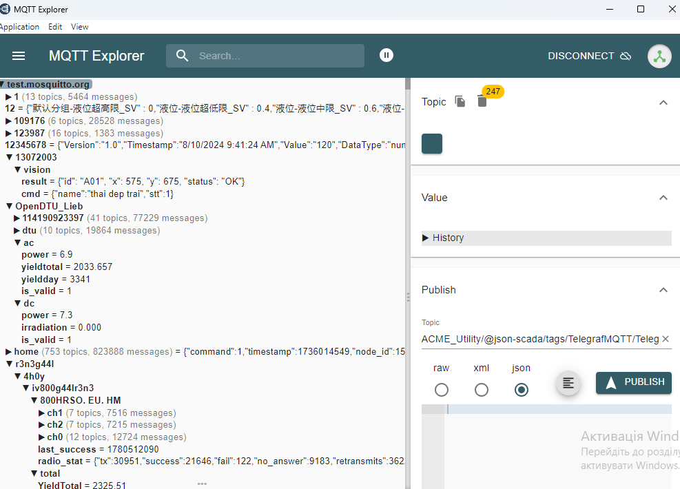

де `myname` - це якесь придумане ім'я, яке має бути унікальне в адресному просторі брокера

-  задайте QoS=1, виставіть опцію Retain
-  в поле `Message`пишіть якесь числове значення
-  зробіть публікацію
-  відкрийте MQTT Explorer, в Advanced налаштуйте фільтр на ваші публікації, які задаються полем `myname`
-  знайдіть це повідомлення і передивіться його значення
-  в HiveMQ ще кілька раз введіть різні значення і зробіть публікацію

####  Відкриття сторінки з варіантом на тестовому сервері

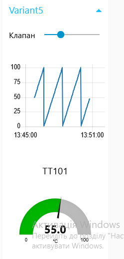

-  Перейдіть на http://edu.asu.in.ua:1880/ui/#/0 (надалі, **тестовий сервер**) виберіть вкладку і групу елементів **з вашим варіантом**.
- повзунок для керування клапаном
- тренди температури, позиції клапану, та секундної пилоподібної кривої (0-100)
- круговий індикатор температури

[](https://github.com/asu-in-ua/atpv/blob/main/iiot/mqtt/media/Рисунок2.png)

рис.4. Вигляд сторінки з варіантом на тестовому сервері

#### Перевірка підключення до тестового варіанту


-  У MQTT Explorer відключіться від брокера
-  Виберіть брокер `test.mosquitto.org`
-  Зайдіть в налаштування `Advanced`, де:
  -  видаліть усі теми
  -  добавте нову тему для підписування `NUFT TI4/#`
  -  вкажіть QoS=0
  -  натисніть ADD
  -  натисніть `Back`
-  Натисніть `Connect` для підключення до брокера
-  На тестовому сервері (http://edu.asu.in.ua:1880/ui/#/0) змініть якісь значення повзунків
-  У MQTT Explorer  мають з'явитися відповідні записи

####   Зміна даних на тестовому сервері через MQTT


-  У MQTT Explorer на панелі Publish в полі Topic впишіть “NUFT TI4/Variant**X**/TT101”, де **X** – номер вашого варіанту.
-  QoS задайте рівним 0,
-  Виберіть тип повідомлення `RAW`
-  У полі Message введіть значення від 10.5, натисніть `Publish`.
-  Перейдіть на тестовий сервер, подивіться як змінюється значення на круговому індикаторі.
-  Зробіть поступове введення 30, 75, 50, з періодичністю 5 секунд, після  кожного натискайте Publish. Подивіться як змінюється значення на тренді.

###  Зв’язок Node-RED з іншими пристроями по MQTT


####  Налаштування отримання даних по MQTT


-  Відкрийте Node-RED.
-  Створіть нову вкладку з іменем `MQTT` та деактивуйте існуючі.
-  З розділу палітри `Network` вставте вузол `MQTT In`. В налаштуваннях Server добавте новий брокер MQTT з назвою `mosquitto` і адресою серверу http://test.mosquitto.org

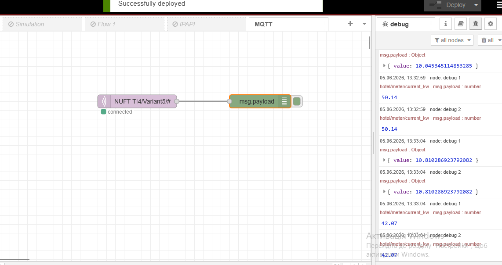

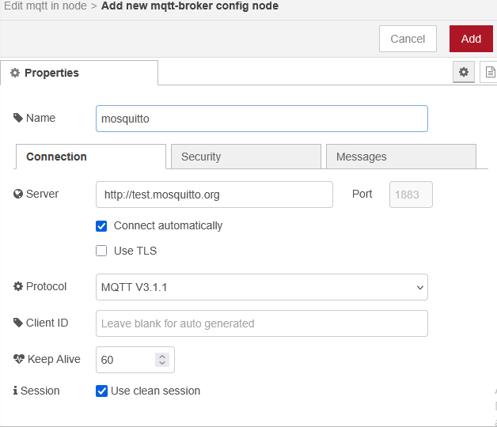

- 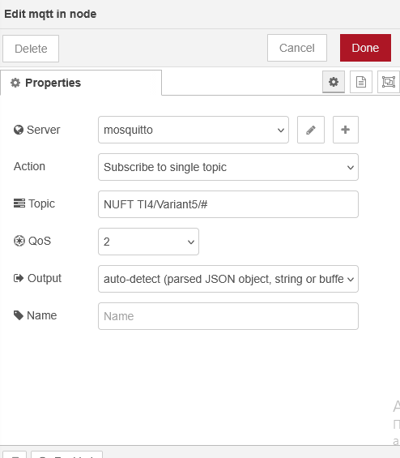

  

-  У полі Topic вузла `MQTT in` введіть `NUFT TI4/VariantX/#` де **X** – номер вибраного варіанту. Це значить, що цей вузол підписується на всі теми з даної гілки.

-  Використайте вузол Debug для виведенню повідомлень. Зробіть  розгортання, дочекайтеся коли вузол «MQTT in» покаже статус «Connected».

У випадку відсутності зв’язку з брокером зробіть спробу пізніше.

#### 2.2. Тестування отримання даних по MQTT


-  Активуйте на боковій панелі режим відображення повідомлень  відлагодження. Змініть значення на тестовому сервері для клапану зі  свого варіанту.
-  Використовуючи MQTT Explorer задайте значення температури. Зробіть аналіз виведених повідомлень на бічній панелі.

#### 2.3. Тестування відправки даних по MQTT


-  Використовуючи вузли «Slider» з Dashboard та «MQTT out» самостійно  реалізуйте зв'язок локального графічного інтерфейсу з віртуальним  приладом на тестовому сервері, що показує TT101 для вашого варіанту.
-  Використовуючи вузли «gauge» і «MQTT in» самостійно реалізуйте зв'язок  локального графічного інтерфейсу з повзунком завдання ступені відкриття  клапану на тестовому сервері для вашого варіанту.

.Для відображення підписів використовуйте теми а для  формату відображення чисел ангулярні фільтри.

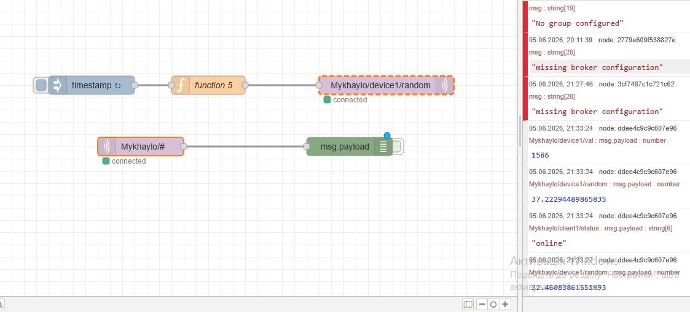


#### Генерування синусоїди


-  Модифікуйте програму так, як це показано на рисунку нижче. Перейдіть на тестовий сервер, подивіться результат.

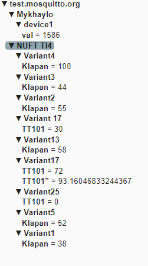

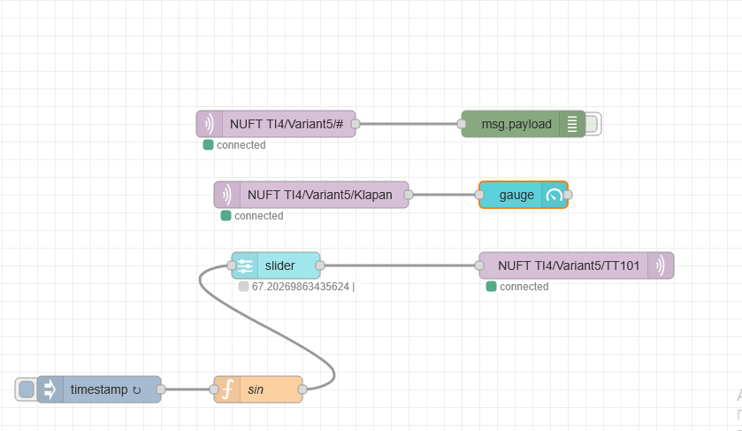

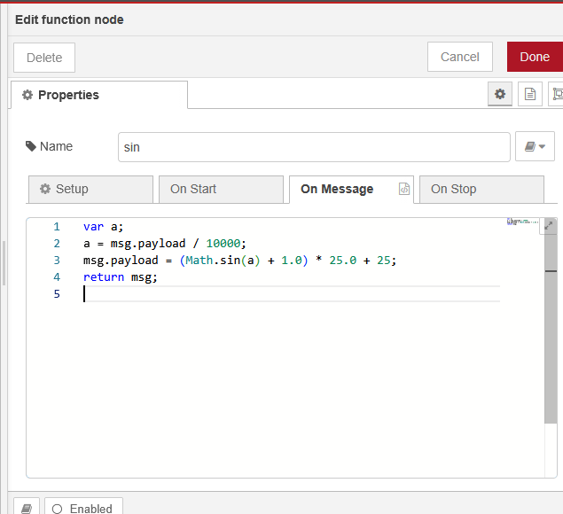


#### Реалізація "коротко-замкнутого" з'єднання видавця і абонента в Node-RED


Для тестування можливостей MQTT в Node-RED рекомендується  зав'язати видавця з абонентом у тому самому потоці але з різними  підключеннями.

-  У Node-RED створіть новий потік (вкладку).
-  Реалізуйте там наступний фрагмент програми, при умові що:
  -  в налаштуваннях сервера вибираєте існуюче підключення і змінюєте його налаштування `Messages`
  -  слово `pupenasan` змінюєте на власну унікальну назву типу `myname` , який був вибраний Вам в п.1.3
  -  Для `MQTT-in` та `MQTT-out` пропишіть різні підключення `Client1` та `Client2`
  -  Обов'язково вкажіть унікальні ідентифікатори для клієнтів
  -  Періодичність оновлення верхнього потоку (властивість `Inject`) задайте рівним 10 секунд


 Реалізація "коротко-замкнутого" з'єднання видавця і абонента в Node-RED

-  Програма функції має наступний вигляд:

```
let rad = context.get ("rad") || 0;
rad = (rad>6.28) ? 0 : rad + 0.1;
msg.payload = (Math.sin (rad)+1)/2*100; 
context.set ("rad", rad);
return msg;
```

​                           

-  запустіть потік на виконання, перевірте що повідомлення відображаються на бічній панелі
-  У MQTT Explorer у налаштуваннях підключення Advanced, підпишіться на гілку `myname/#` з QoS1
-  перевірте що тема `myname/device1/random` оновлюється
-  перевірте що статус `myname/client1/status` рівний `online`

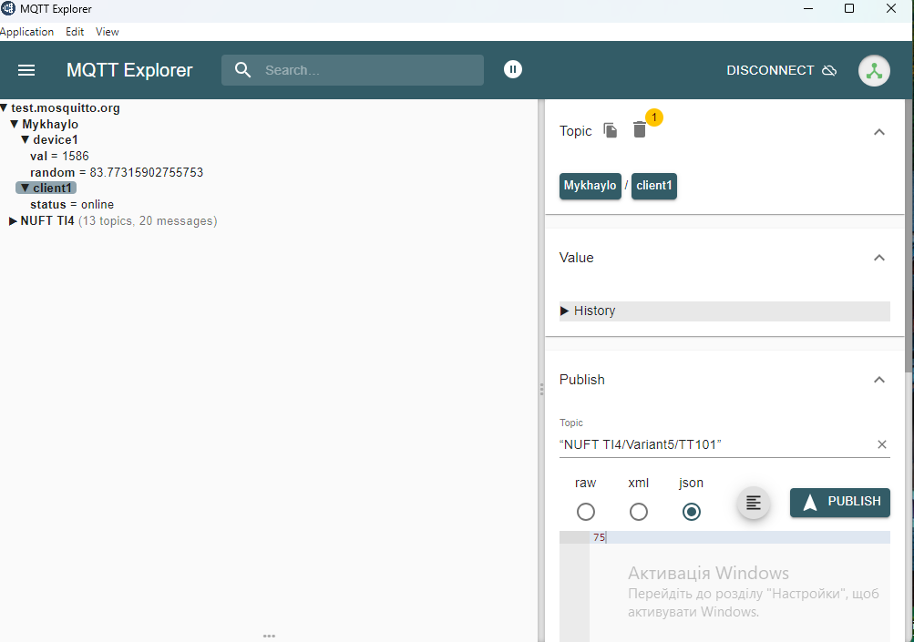