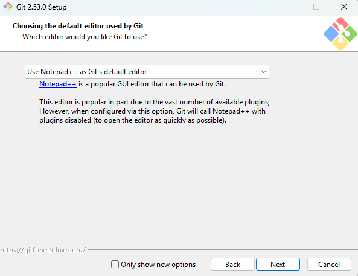
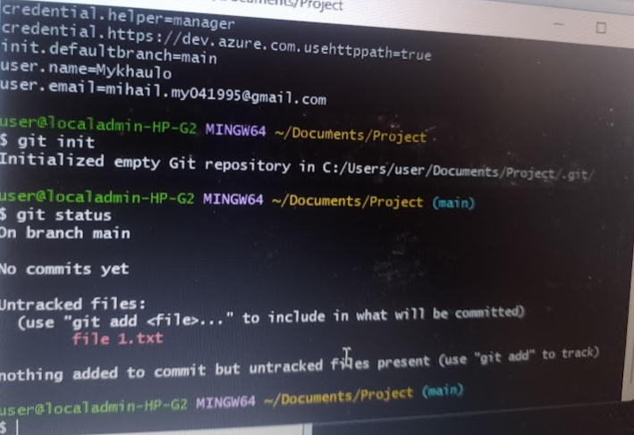
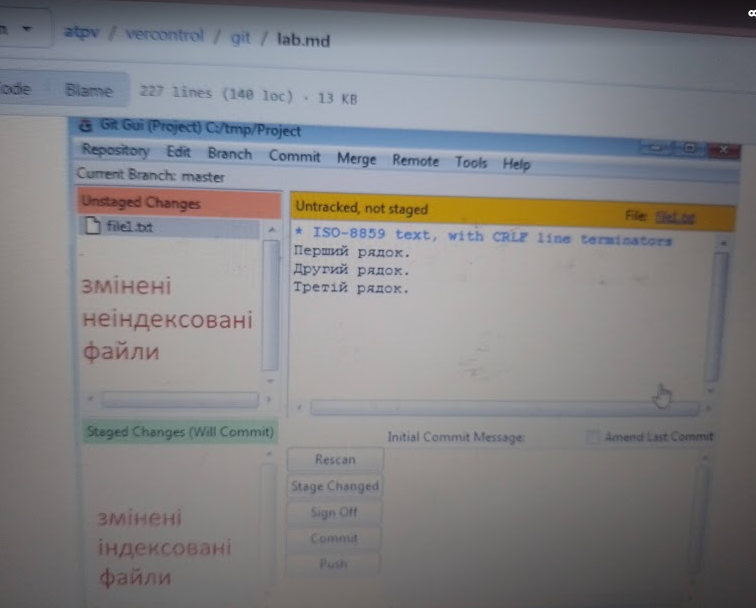

Тут я Завантажив та інсталював Git https://git-scm.com/downloads.


Тут я в консолі вводив команду перегляду конфігурації та Використовуючи команду `git status` виведіть стан репозиторію.




Тут я Переглядав зміни у файлі




-  Запустіть команду для добавлення файлу на індексування.

```
git add file1.txt  
```


-  Використовуючи команду `git status` виведіть стан репозиторію.
-  Зробіть копію екрану для звіту і визначте призначення кожного статусного рядку.
-  Якщо `Git Gui` відриктий зробіть `Rescan`.


Тут я

- Створював новий файл в робочій директорії з назвою `file2.txt`.
-  Записував туди три довільні рядки.
-  У файлі `file1.txt` видалив другий рядок, та добавив в кінець рядок з написом `четвертий рядок`.
-  Добавив обидва файли до індексу та зробив коміт.

```
git add *.txt
git commit -m 'Друга версія проекту' 
```


-  Виконав команду для перегляду історії проекту.

```
git log
```


