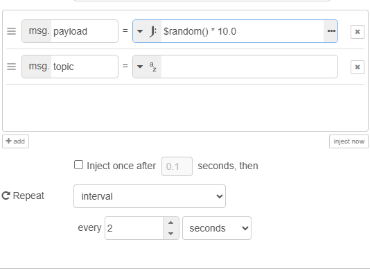
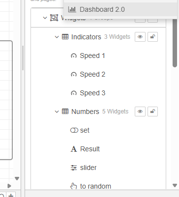
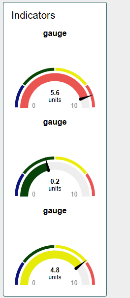
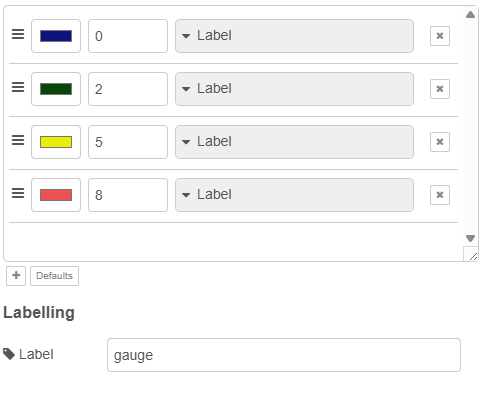
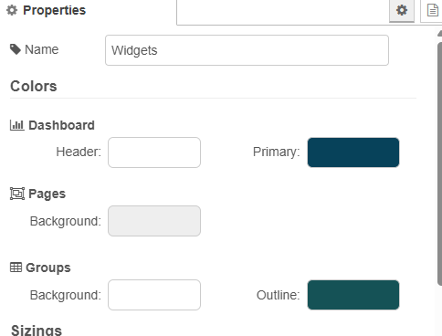
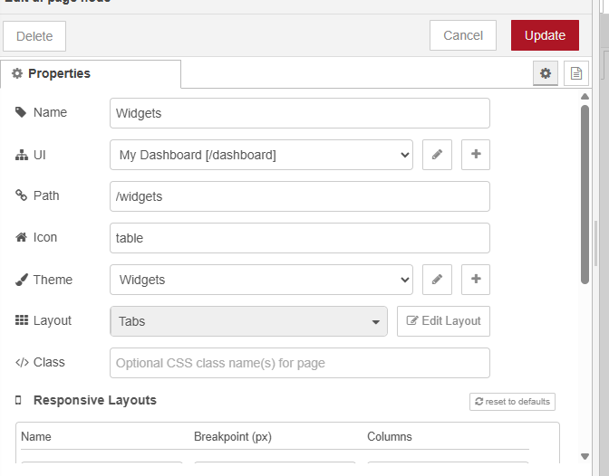
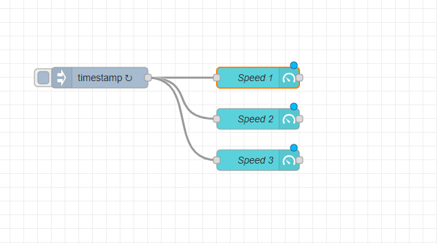
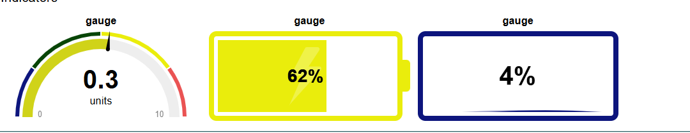
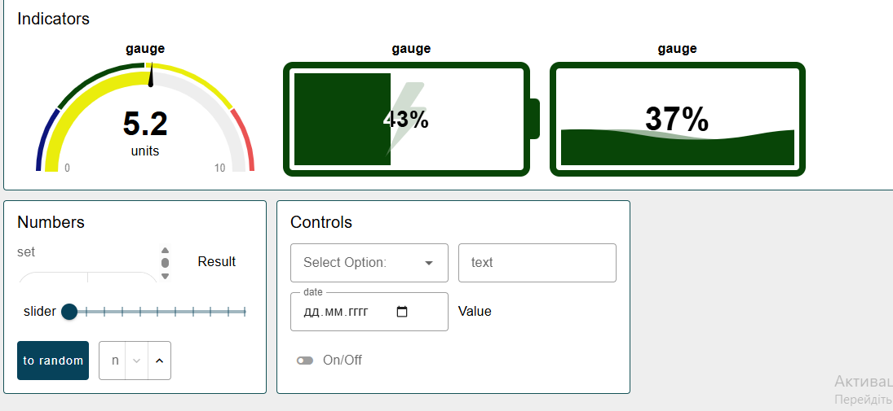
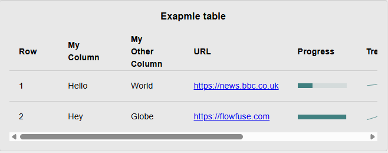

- Розмістіть вузли `Inject` та `Gage` на сторінці потоку та з'єднайте між собою 

У чистому проєкті для `gage` автоматично створяться усі налаштування за замовченням.

- Зробіть розгортання проєкту.
-  Перейдіть на сторінку dashboard через бічну панель, для цього можна зайти в меню Dashboard 2, і натиснути відповідну кнопку

ТУТ Я відображав індикатори  у неформатованому вигляді і з певними налаштуваннями вигляду. Кожні 2 секунди воно має змінювати значення.

Ту я змінив налаштування Gaguge, щоб він:

- показував заокруглене значення до одного знаку після коми `$round(payload, 1)`
- мав чотири підсвічувані різним кольором діапазони
- над ним писалася назва `Speed`
- одиниці вимірювання були `m/s`

Тут я змінив кольорову гаму в налаштуваннях теми

 За допомогою кнопок я налаштував на бічній панелі змініть назву сторінки на `Widgets` і шлях до сторінки `/widgets`

Скопіюйте віджет `Speed` два рази і модифікуйте потік як показано на рис.7, тобто щоб усі три віджети розміщувалися в одній групі `Indicators`

тут я виконав такі команди:

- змінив діапазони зміни значення в групі Numbers
- зробив щоб значення змінювалося після пересування повзунка `slider` а не після його відпускання
- використовуючи віджет Gauge з типом `Tile` зробив поле відображення значення зі зміною кольору фону (рис.13)
- у віджет `select options` добавив нове значення

Тут я Перевірив роботу таблиці, зовнішній вигляд має бути щось на кшталт як показано на рис.14. При цьому значення поля `Progress` поивнно змінюватися кожні 2 секунди.

