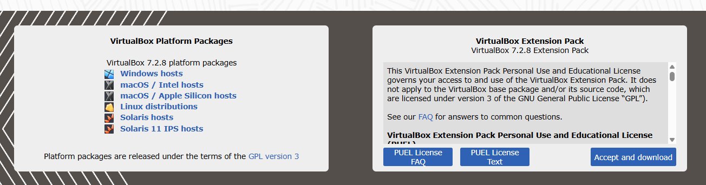
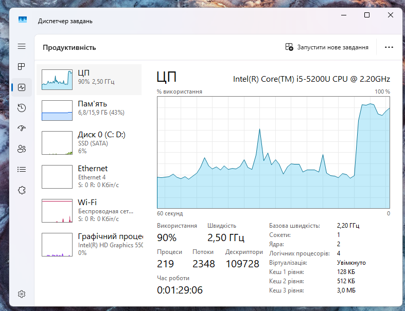
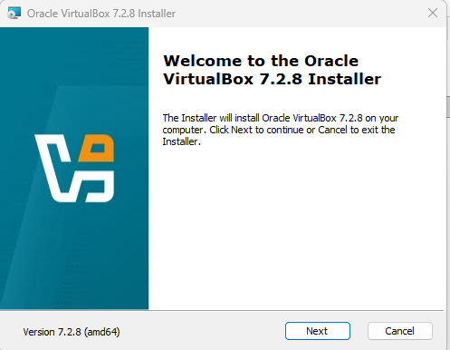
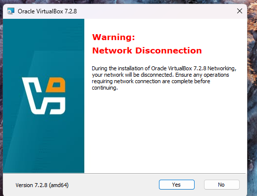
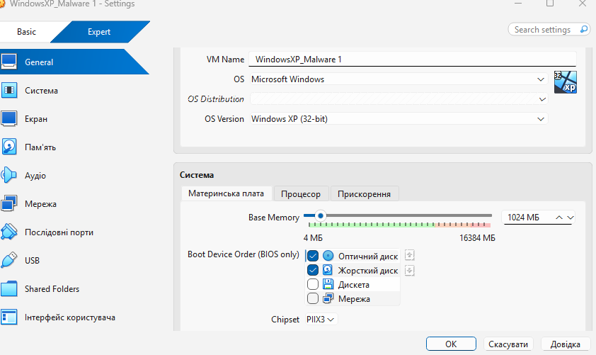
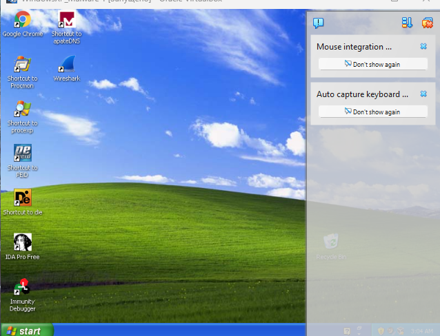
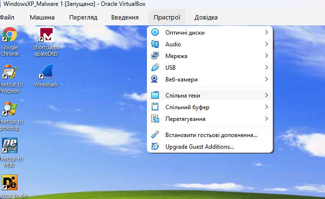
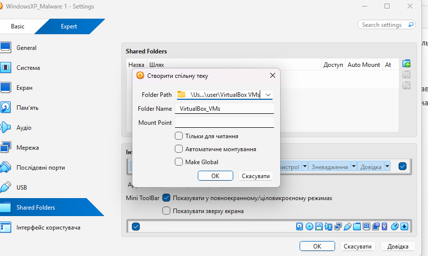
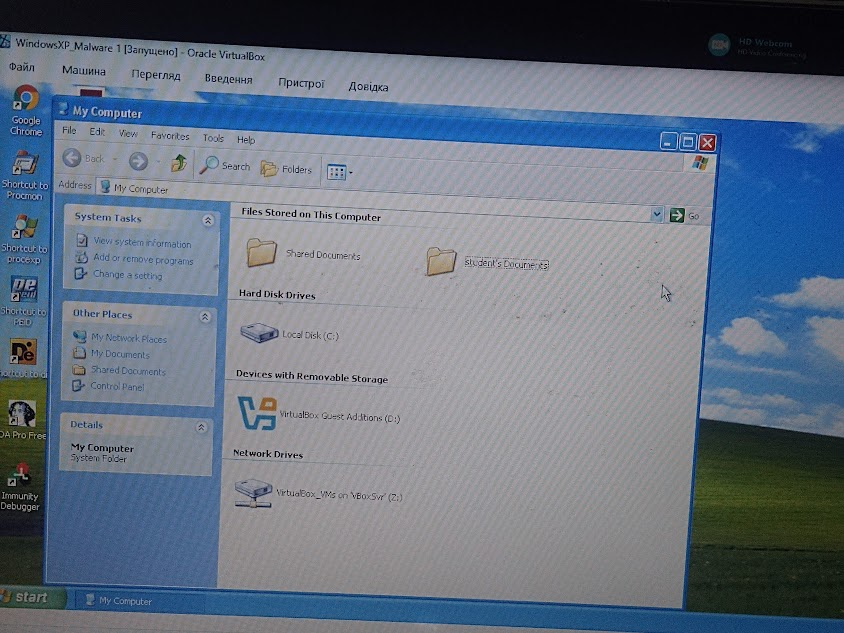

- Перевірте чи в BIOS вашого ПК виставлена опція підтримки віртуалізації, якщо ні - активуйте її. Спосіб активації залежить від типу Bios.
-  Завантажте VirtualBox з https://www.virtualbox.org/wiki/Downloads програму відповідно до вашої операційної системи
- 

Перевірте що увімкнена віртуалізація. Для цього запустіть диспетчер завдань (CTRL+ALT+DEL), на вкладці `Продуктивність` має бути `Віуртуалізація увімкнута`

- Завантажте образ віртуальної машини для віртуального робочого місця; Ви можете отримати репозиторій з одного з наведених нижче місць розташувань
  - [підготовлена віртуальна машина Windows XP з репозиторію курсу CMSC 449/691 Malware Analysis](https://redirect.cs.umbc.edu/courses/undergraduate/CMSC491malware/WindowsXP_Malware.ova) (Логін: Student, Пароль: infected)
-  Запустіть на виконання VirtualBox. У вікні налаштування вибрати "Файл/імпортувати віртуальну машину" (рис.2) і вкажіть до образу віртуальної машини: папка «Дистанційна Пром мереж» файл `WindowsXP_Malware.ova`

- Протягом певного часту машина буде імпортуватися про що свідчитиме вікно статусу, після закінчення імпорту віртуальна машина буде готова до експлуатації.
-  Відкрийте налаштування віртуальної машини через її контекстне меню, або через відповідний пункт головного меню
- 

- Запустіть віртуальну машину. Для запуску віртуальної машини, вона вибирається зі списку і викликається команда «Запустити».
-  У меню віртуальної машини у пункті `Пристрої` виберіть `Встановити гостьові доповнення`

-  Залиште всі пункти меню за замовченням і погодьтеся зі встановленням.
-  Встановлення може зайняти кілька хвилин. Після завершення встановлення усіх гостьових доповнень система запропонує перезавантажити віртуальну машину, натисніть `Finish` щоб машина перезавантажилася.
-  Після перезапуску переведіть вікно віртуальної машини у повноекранний режим за допомогою комбінації клавіш `Правий Ctrl + F`

- Вимкніть віртуальну машину, якщо вона увімкнена.
-  Зайдіть в налаштування віртуальної машини. У вкладці `Спільні теки` натисніть кнопку додавання нових папок.
-  Виберіть папку яка буде використовуватися для обміну між хостовою та гостьовою ОС та натисніть `Ок`

- Запустіть віртуальну машину. Перевірте що папка доступна як зовнішній диск. Спробуйте перекопіювати якісь файли з гостьової ОС на хостову.
- 

