### 1. Встановлення браузера FireFox

- У прикладах в  лабораторній роботі використовується українська версія FireFox. Для  спрощення роботи завантажте та встановіть її за наступним посиланням https://www.mozilla.org/uk/firefox/download/thanks/. При виконанні лабораторної роботи дозволяється використовувати і інші інструменти.

### 2. Перевірка роботи ВЕБ-застосунку BarCat Reader

-  Відкрийте сторінку в браузері https://barcatreader.onrender.com/ і перевірте її роботу. Для цього завантажте будь-який файл з зображенням штрих-коду, наприклад [звідси](https://barcatreader.onrender.com/Samples) 

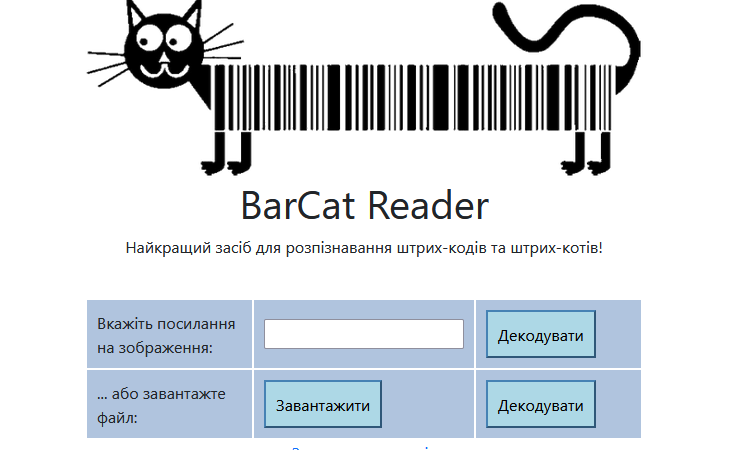

Натисніть «Завантажити», оберіть файл з штрих-кодом, завантажте його та  натисніть відповідну кнопку "Декодувати" при вдалій обробці запиту буде  повернений результат з кодом,

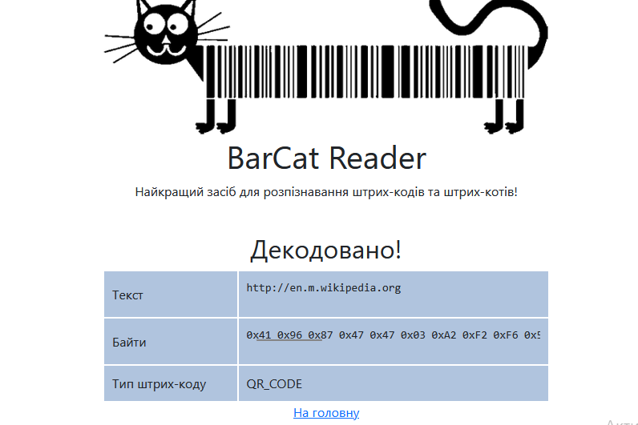

### 3. Робота з Монітором мережі FireFox

-  Активуйте в браузері FireFox інструмент монітору мережі  «Веб-розробка->Мережі» (CTRL+Shift+E), або аналогічний в інших  браузерах.
-  Виставте опцію «Вимкнути кеш» з панелі інструментів Монітору мережі. Це потрібно щоб не використовувалася інформація в кеші на Вашому ПК.
-  Відкрийте в браузері сторінку https://barcatreader.onrender.com/.
-  Проконтролюйте, щоб мережних запитів було 9. Якщо це не так - зробіть  оновлення сторінки браузера іі знову впишіть вказану адресу.
-  Подивіться список мережних запитів, які були зроблені при завантаженні сторінки, зокрема зверніть увагу на наступні значення:
  - скільки запитів було зроблено
  - які методи (спосіб) та типи запитів
  - які були повернуті результати (стани), скористуйтеся [даним ресурсом Вікіпедії](https://uk.wikipedia.org/wiki/Список_кодів_стану_HTTP) для визначення стану

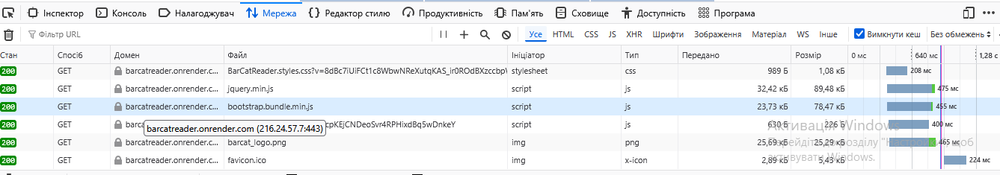

### 4. Аналіз заголовків 1-го мережного запиту та відповіді

-  Виберіть перший запис у списку запит і відкрийте панель «Заголовки».
-  Ознайомтеся з призначенням використаних в запиті заголовків з ресурсів Інтернет, наприклад з [Вікіпедії](https://uk.wikipedia.org/wiki/Список_заголовків_HTTP).
-  Заповніть перші два поля таблиці, наведеної нижче, для пояснення заголовків **в запиті**. Для зручності розшифрування можете скористатися посиланнями в колонці Заголовок.  Інші поля можете розібрати за бажанням.
- 

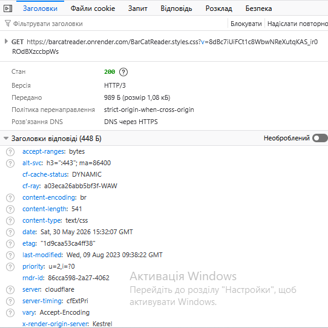

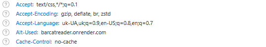

Перегляньте вміст відповіді у вкладці «Відповідь» на перший запит.  Зробіть висновок щодо результату запиту. Впишіть результати в перший  рядок таблиці 3.

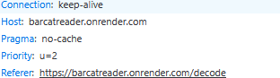

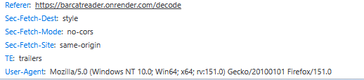

Відкрийте корисне навантаження відповіді на панелі «Відповідь» (у форматі HTML).

 Для того, щоб зручніше проаналізувати вміст завантаженої сторінки:

-  скопіюйте його в буфер
-  відкрийте на іншій закладці браузеру посилання https://www.freeformatter.com/html-formatter.html
-  помістіть скопійований текст в поле «Option 1: Copy-paste your HTML  document here» після чого натисніть на кнопку «format HTML». У вікні  «Formatted HTML:» з’явиться відформатований код сторінки в форматі HTML.

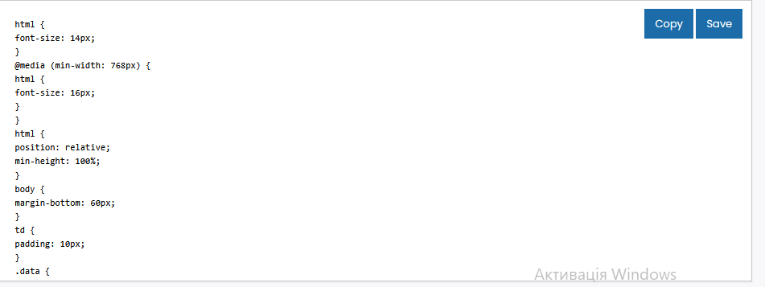

-  На диску `C:\` створіть директорію «Temp», якщо вона ще не існує.
-  Скопіюйте в папку `C:\Temp\barcods` файл з зображенням штрих-коду, що використовувався в попередній частині, наприклад взятий [звідси](https://barcatreader.onrender.com/Samples).

### 2. Читання файлу

-  Запустіть Node-RED, якщо він не запущений.
-  Створіть нову вкладку
-  З [довідника](https://pupenasan.github.io/NodeREDGuidUKR/files/) ознайомтеся з вбудованими функціями роботи з файлами. Ці вузли детально розглядаються на інших заняттях.
-  З розділу `Storage` палітри вузлів вставте вузол `File in`.
-  Налаштуйте його таким чином, щоб він зчитував дані з файлу з  штрих-кодом та виводив його вміст на панель відлагодження (Debug)  див.рис.2.14. Зверніть увагу, що виведення в `Debug` треба робити як `complete msg object` а не як `msg.payload`.
- 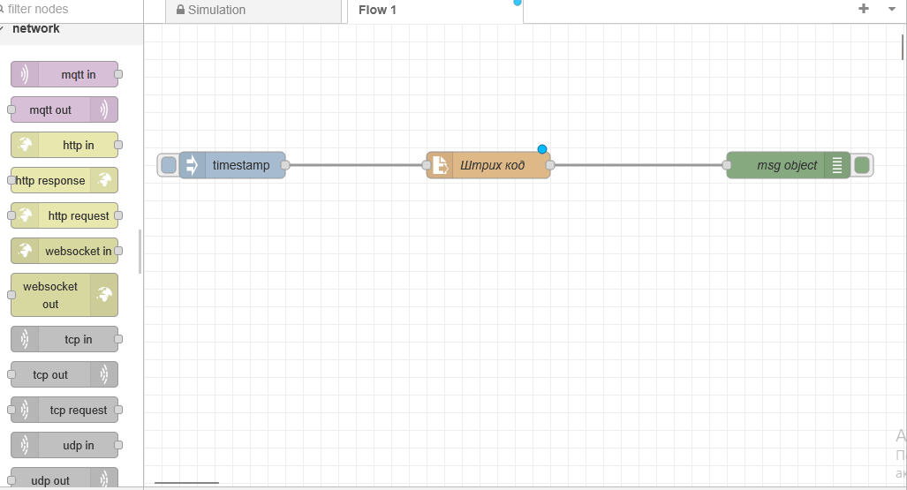

### Відправлення запиту

-  З розділу `network` палітри вузлів вставте вузол `HTTP request`.
-  Модифікуйте програму, як це показано на рис.2.16. Зверніть увагу, що  для кращого тестування бажано вивести як вхідне так і вихідне  повідомлення `HTTP request`.

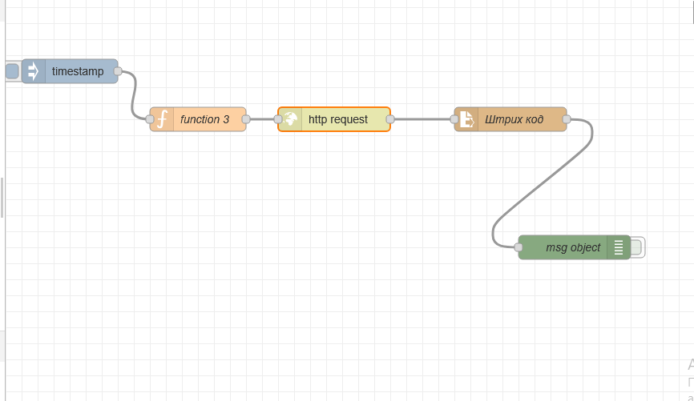

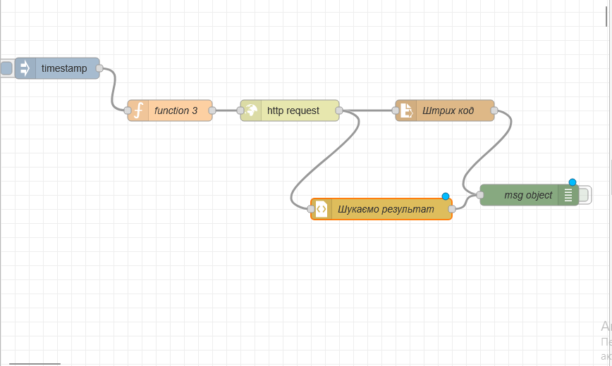

