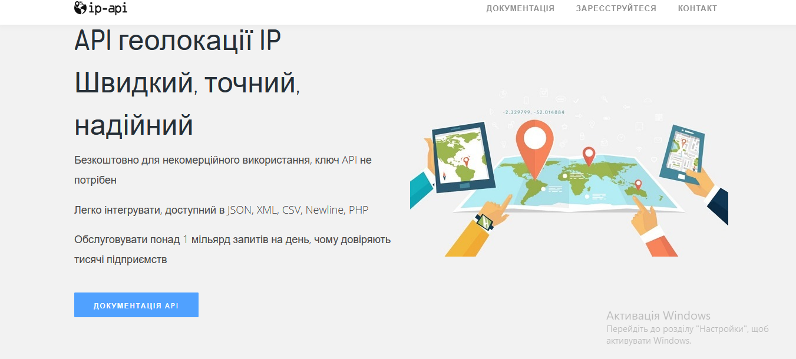
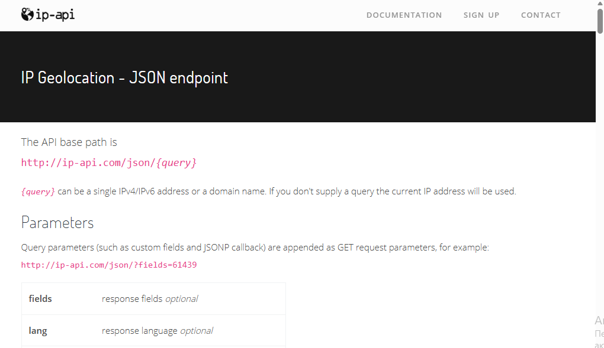
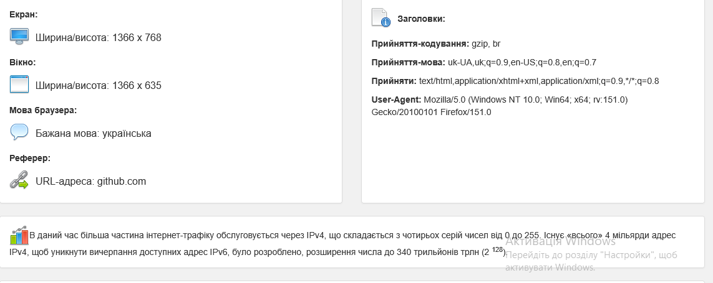
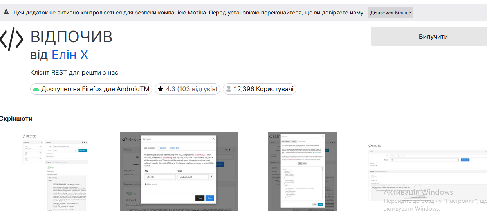
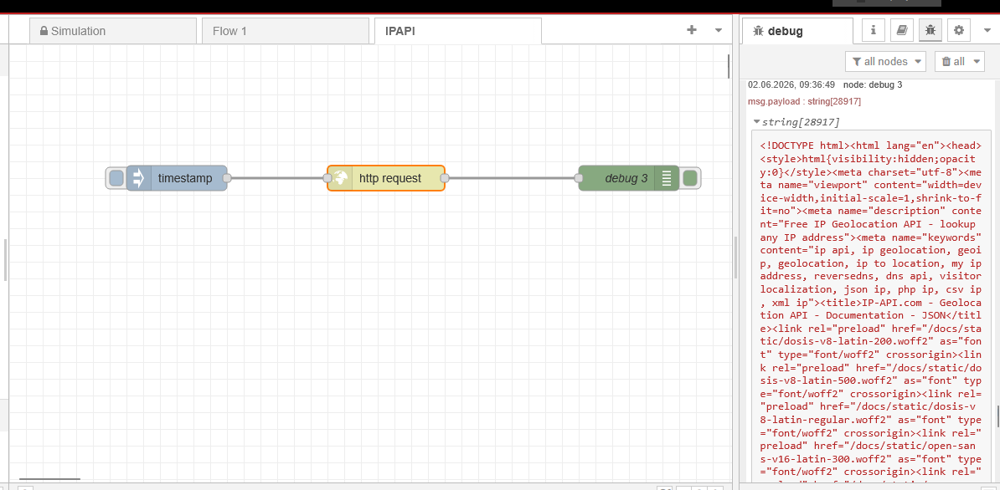
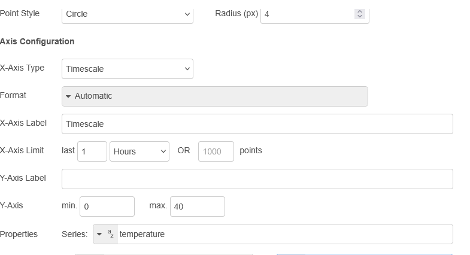

### Знайомство з сервісами IPAPI

У якості прикладу серверного Веб-застосунку використовуватиметься  [IPA-PI](https://ip-api.com/), який дає можливість визначити деталі місця розташування за IP адресою.  Це можна зробити через сторінку Веб-інтерфейсу, або через відкритий  API-інтерфейс. Повний опис API з форматом JSON доступний за [посиланням](https://ip-api.com/docs/api:json).

-  Зайдіть на сторінку за посиланням https://ip-api.com.
-  Ознайомтеся зі змістом сторінки. Зверніть увагу на ту інформацію, яка  надається по IP-адресі, а також на значення Вашої білої адреси IP,  вірніше від якої Ваш пристрій спілкується в Інтернеті.

Слід розуміти, що у більшості випадків видима IP-адреса –  це одна з адрес провайдера, що надає послуги Інтернету, тому координати  будуть саме цього провайдера.

-  Подивіться на приклад запиту і відповіді в форматі JSON.

-  Зайдіть на сайт https://www.myip.com/, подивіться яка інформація там надається.

-  Ознайомтеся з API-сервісом https://www.myip.com/api-docs/.

  

Для тестування API Ви можете користуватися будь якою  онлайн або офлайн утилітою. У даній лабораторній роботі пропонується  скористатися доповненням до браузерів `FireFox` з назвою RESTED або `Chrome` з назвою REST API Tester.

-  Встановіть розширення для браузера, або аналогічне, яке можна знайти за посиланнями:
- для Firefox https://addons.mozilla.org/en-US/firefox/addon/rested/

Запустіть Node-RED, створіть нову вкладку з назвою `IPAPI`.

 самостійно реалізуйте програму, яка буде використовуючи вузол “Http  request” для витягування інформації про білий IP, використовуючи сервіси  http://ip-api.com/json/. Зверніть увагу, що **IP-API може повернути негативну відповідь** - це може бути спричинено обмеженим використанням безкоштовного сервісу.

У цьому пункті необхідно самостійно ознайомитися з API сервісу надання даних по температурі та вивести прогнозні дані на добу

-  Перейдіть на сторінку опису документації [open-meteo](https://open-meteo.com/en/docs). Використовуючи наявний опис та налаштування виведіть прогнозні дані у вигляді графіку на екран для Вашого місця перебування

Подивіться на сформований API URL та відкрийте його в браузері. Проаналізуйте отриманий результат.

 Зробіть фрагмент програми в Node-RED для формування запиту, подивіться результат за допомогою вікна `Debug`.

 Реалізуйте відображення архівних даних за допомогою вузла Chart в Dashboard2.

