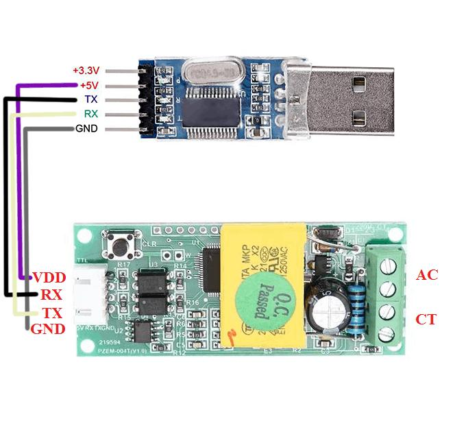
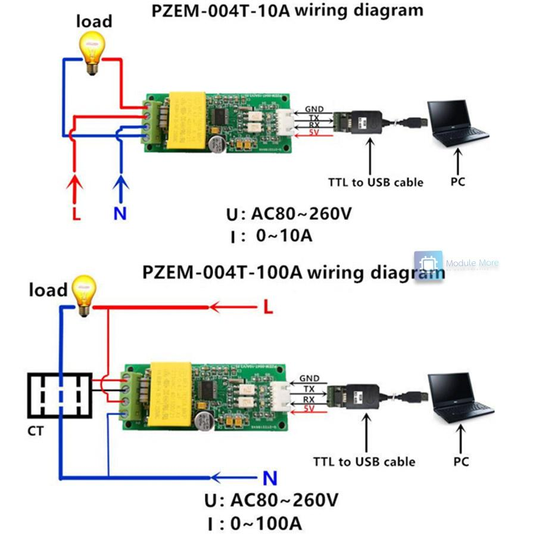
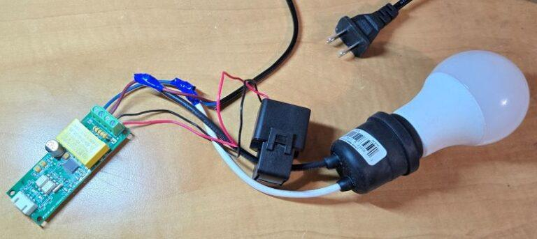

        ┌────────────────────┐
        │   Датчик струму   │
        │ (PZEM)    
        └─────────┬──────────┘
                  │ GPIO / UART
                  ▼
        ┌────────────────────┐
        │   Raspberry Pi     │
        │    (Node-RED)      │
        └───────┬────────────┘
                │
     ┌──────────┼───────────┬───────────────┐
     ▼          ▼           ▼               ▼
┌─────────┐ ┌──────────┐ ┌──────────┐ ┌────────────┐
│  БД     │                   │ Web UI   │            │ Telegram │          │ GoogleSheet│
│MariaDB  │             │Dashboard │           │   Bot    │               │   (Cloud)  │
└─────────┘ └──────────┘ └──────────┘ └────────────┘
                │
                ▼
        ┌────────────────┐
        │   Користувач   │
        │ (ПК / Телефон) │
        └────────────────┘

 **PZEM-004T**

Що тут важливо:

- GPIO → датчики
- Internet → Telegram + Google
- Dashboard → локальний доступ

**PZEM-004T** — це цифровий модуль вимірювання електроенергії змінного струму (AC), який використовується в IoT та системах автоматизації.

👉 Він дозволяє в реальному часі вимірювати:

- напругу
- струм
- потужність
- енергію

------

# 🔌 Основні характеристики

| Параметр   | Значення                       |
| ---------- | ------------------------------ |
| Напруга    | 80–260 В AC                    |
| Струм      | до 100 А (через трансформатор) |
| Потужність | до ~23 кВт                     |
| Інтерфейс  | UART (TTL)                     |
| Живлення   | 5V                             |
| Точність   | ~1%                            |

------

# 📊 Що саме вимірює

PZEM одразу дає **готові значення (це його головний плюс):**

- ⚡ **Voltage (V)** — напруга мережі
- 🔌 **Current (A)** — струм
- 🔥 **Power (W)** — активна потужність
- 📈 **Energy (kWh)** — спожита енергія

👉 На відміну від ACS712 — нічого рахувати не треба.

------

# 🔧 Як працює датчик

5

Принцип роботи:

1. **Напруга** — вимірюється напряму з мережі
2. **Струм** — через трансформатор (CT clamp)
3. Мікроконтролер всередині:
   - аналізує сигнал
   - обчислює потужність
   - накопичує енергію
4. Дані передаються через **UART**

# Підключення до Raspberry Pi

##  Піни:

| PZEM | Raspberry Pi |
| ---- | ------------ |
| VCC  | 5V           |
| GND  | GND          |
| TX   | RX (GPIO15)  |
| RX   | TX (GPIO14)  |

 ВАЖЛИВО:

- рівні TTL (3.3V сумісні)
- іноді потрібен level shifter